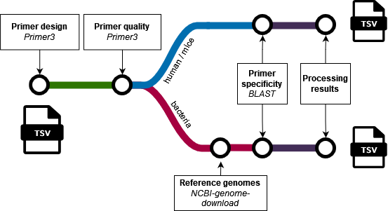

<h1>
  <picture>
    <source media="(prefers-color-scheme: dark)" srcset="docs/images/getprimerslogodark.png">
    
  </picture>
</h1>

[](https://github.com/nf-core/getprimers/actions/workflows/ci.yml)
[](https://github.com/nf-core/getprimers/actions/workflows/linting.yml)[](https://nf-co.re/getprimers/results)[](https://doi.org/10.5281/zenodo.XXXXXXX)
[](https://www.nf-test.com)

[](https://www.nextflow.io/)
[](https://docs.conda.io/en/latest/)
[](https://www.docker.com/)
[](https://sylabs.io/docs/)

## Introduction

**getprimers** is a bioinformatics pipeline that generates primers and checks the quality and specificity.

1. Design primers using [Primer3](https://github.com/primer3-org/primer3)
2. Check quality of primers using [Primer3](https://github.com/primer3-org/primer3)
3. Optional: pull reference genomes if working with bacterial proteins, using [NCBI-genome-download](https://github.com/kblin/ncbi-genome-download)
4. Check specificity of primers using [BLAST](https://blast.ncbi.nlm.nih.gov/Blast.cgi) against reference genomes

<picture>
    
</picture>

## Usage

> [!NOTE]
> If you are new to Nextflow and nf-core, please refer to [this page](https://nf-co.re/docs/usage/installation) on how to set-up Nextflow. Make sure to [test your setup](https://nf-co.re/docs/usage/introduction#how-to-run-a-pipeline) with `-profile test` before running the workflow on actual data.

First, prepare a samplesheet with your input data that looks as follows:

`samplesheet_bacteria.csv`:

```csv
protein_ID,taxonomy,sequence

```
Each row represents a protein.

Now, you can run the pipeline using:

```bash
nextflow run getprimers \
   -profile <docker/singularity/.../institute> \
   --input samplesheet.csv \
   --genome hg38 \
   --outdir <OUTDIR>
```

> [!WARNING]
> Please provide pipeline parameters via the CLI or Nextflow `-params-file` option. Custom config files including those provided by the `-c` Nextflow option can be used to provide any configuration _**except for parameters**_; see [docs](https://nf-co.re/docs/usage/getting_started/configuration#custom-configuration-files).

For more details and further functionality, please refer to the [usage documentation](https://github.com/barbarahelena/getprimers/tree/TEMPLATE/docs/usage.md) and the [parameter documentation](https://github.com/barbarahelena/getprimers/tree/TEMPLATE/docs/parameters.md).

## Pipeline output

To see the results of an example test run with a full size dataset refer to the [results](https://github.com/barbarahelena/getprimers/tree/TEMPLATE/docs/results.md) documentation. There is also a more specific [output](https://github.com/barbarahelena/getprimers/tree/TEMPLATE/docs/output.md) doc.

## Credits

getprimers was written by me, but I tried to follow the nf-core template as much as possible.

## Citations

An extensive list of references for the tools used by the pipeline can be found in the [`CITATIONS.md`](CITATIONS.md) file.

You can cite the `nf-core` publication as follows:

> **The nf-core framework for community-curated bioinformatics pipelines.**
>
> Philip Ewels, Alexander Peltzer, Sven Fillinger, Harshil Patel, Johannes Alneberg, Andreas Wilm, Maxime Ulysse Garcia, Paolo Di Tommaso & Sven Nahnsen.
>
> _Nat Biotechnol._ 2020 Feb 13. doi: [10.1038/s41587-020-0439-x](https://dx.doi.org/10.1038/s41587-020-0439-x).
